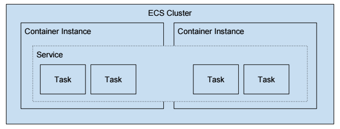
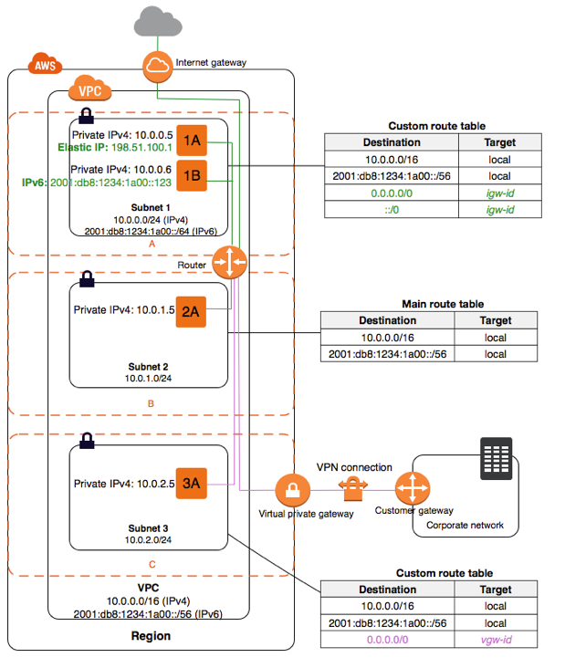

# Art Service Infrastructure as Code

This is the repository for storing all of the art service's infrastructure as code using Terraform.

## Overview

Currently all infrastructure is set up using Terraform on AWS. Each different type of AWS service is given its own administrator IAM user, employing that for the necessary permissions. All terraform should also share the same remote backend on AWS S3 so that state is shareable regardless of the developer.

## Shared Remote State

This is set up as an S3 bucket on AWS. For initial setup you will need to initialise the S3 bucket and then migrate the existing state over. The file path for the state should then match:

```
service-type/service-implementation/further-details/terraform.tstate
```

For example, for the `art-service-sourcing-data-service` the file path should be:

```
ecs/ecr-repositories/art-service-sourcing-data-service/terraform.tstate
```

This should also match the folder structure in the repository.

## ECS

### How Does ECS Work?

ECS is the AWS Docker container service which handles the orchestration and provisioning of Docker containers. It works as below:



There exists a cluster of EC2 container instances. Running amongst the EC2 instances is a service. That service can hold multiple instances of a task. The service is responsible for scaling the task definitions up and down as well as bringing them back up if they fall over.

### How Does Our Particular Instance of ECS Work?

The autoscaling group and launch configuration launch an instance of EC2 attached to the autoscaling group. The line where it echoes the ECS cluster name into the ECS config is when it registers that particular instance to a part of the ECS cluster.

### ECS Cluster

#### Tasks and Task Definitions

A task definition is the blueprint of how a docker container should launch. The task is then the running instance of the task definition. They use `.json` files similar to the below in order to define what a docker instance launch looks like.

```
[     
    {
        "name": "sourcing-data-service",
        "image": "257777415217.dkr.ecr.us-east-1.amazonaws.com/artservicesourcingdataservice:latest",
        "cpu": 10,
        "memory": 500,
        "portMappings": [
            {
                "containerPort": 8082,
                "hostPort": 8082
            }
        ],
      "command": [],
        "essential": true
    }
]
```

Here we have an image artservicesourcingdataservice being launched from the attached ECR. It is exposed on port 8082 (where our application is listening).

#### Services

These define long running tasks of the same task definition. 

```
resource "aws_ecs_service" "art-service-sourcing-data-ecs-service" {
  	name            = "art-service-sourcing-data-ecs-service"
  	iam_role        = "${aws_iam_role.ecs-service-role.name}"
  	cluster         = "${aws_ecs_cluster.art-service-ecs-cluster.id}"
  	task_definition = "${aws_ecs_task_definition.art-service-sourcing-data-service.family}:${max("${aws_ecs_task_definition.art-service-sourcing-data-service.revision}", "${data.aws_ecs_task_definition.art-service-sourcing-data-service.revision}")}"
  	desired_count   = 1

  	load_balancer {
    	target_group_arn  = "${aws_alb_target_group.ecs-target-group.arn}"
    	container_port    = 8082
    	container_name    = "sourcing-data-service"
	}
}
```

The above defines a service which holds the task defined previously. We see it is exposed on port 8082 and aims to have one instance running. The load balancer then distributes traffic across all instances of the task. The ECS scheduler automatically creates new task instances should any instance terminate unexpectedly.

#### Launch Configurations

This is used to define the type of instance we would like to launch. 

```
resource "aws_launch_configuration" "ecs-launch-configuration" {
    name                        = "ecs-launch-configuration"
    image_id                    = "ami-0b9a214f40c38d5eb"
    instance_type               = "t2.small"
    iam_instance_profile        = "${aws_iam_instance_profile.ecs-instance-profile.id}"

    # This is taken from the standard setup from the wizard
    root_block_device {
      volume_type = "standard"
      volume_size = 8
      delete_on_termination = true
    }

    lifecycle {
      create_before_destroy = true
    }

    # Note, you need to create your own key pair on AWS first to use this
    security_groups             = ["${aws_security_group.ecs-vpc-sg-generic.id}"]
    associate_public_ip_address = "true"
    key_name                    = "${var.ecs_key_pair_name}"
    user_data                   = <<EOF
                                  #!/bin/bash
                                  echo ECS_CLUSTER=${var.vpc_name} >> /etc/ecs/ecs.config
                                  EOF
}
```

#### ECS Service Role

The Amazon ECS service scheduler makes calls to the Amazon EC2 and Elastic Load Balancing APIs on your behalf to register and deregister container instances with your load balancers. Before you can attach a load balancer to an Amazon ECS service, you must create an IAM role for your services to use before you start them. This requirement applies to any Amazon ECS service that you plan to use with a load balancer.

#### ECS Instance Role

The Amazon ECS container agent makes calls to the Amazon ECS API on your behalf. Container instances that run the agent require an IAM policy and role for the service to know that the agent belongs to you. Before you can launch container instances and register them into a cluster, you must create an IAM role for those container instances to use when they are launched. This requirement applies to container instances launched with the Amazon ECS-optimized AMI provided by Amazon, or with any other instances that you intend to run the agent on.

#### Cluster

The cluster is then the logic group of EC2 instances running the ecs-agent software. Each of the EC2 instances is referred to as a container instance.

#### Autoscaling Group

This is the autoscaling group for the EC2 instances. It is associated to the launch configuration. Here we define the maximum and minimum number of instances we expect to run and the launch configuration we want to use for auto-scaling.

```
resource "aws_autoscaling_group" "ecs-autoscaling-group" {
    name                        = "ecs-autoscaling-group"
    max_size                    = "${var.max_instance_size}"
    min_size                    = "${var.min_instance_size}"
    desired_capacity            = "${var.desired_capacity}"
    vpc_zone_identifier         = ["${aws_subnet.ecs-vpc-east-1a-SN0-0.id}", "${aws_subnet.ecs-vpc-east-1a-SN0-1.id}"]
    launch_configuration        = "${aws_launch_configuration.ecs-launch-configuration.name}"
    health_check_type           = "ELB"
}
```

When we create the cluster the launch configuration is used to launch the EC2 instance. The instance is then added to the autoscaling group which can be used to add more instances as necessary.

#### Application Load Balancer 

Our application has a load balancer and a load balancer listener. The load balancer listens from the subnets and then forwards on to the target group.

```
resource "aws_alb" "ecs-load-balancer" {
    name                = "ecs-load-balancer"
    security_groups     = ["${aws_security_group.ecs-vpc-sg-generic.id}"]
    subnets             = ["${aws_subnet.ecs-vpc-east-1a-SN0-0.id}", "${aws_subnet.ecs-vpc-east-1a-SN0-1.id}"]

    tags {
      Name = "ecs-load-balancer"
    }
}

resource "aws_alb_listener" "ecs-alb-listener" {
    load_balancer_arn = "${aws_alb.ecs-load-balancer.arn}"
    port              = "80"
    protocol          = "HTTP"

    default_action {
        target_group_arn = "${aws_alb_target_group.ecs-target-group.arn}"
        type             = "forward"
    }
}

```

#### Target Groups

Each target group is used to route requests to one or more registered targets. When you create each listener rule, you specify a target group and conditions. When a rule condition is met, traffic is forwarded to the corresponding target group.

```
resource "aws_alb_target_group" "ecs-target-group" {
    name                = "ecs-target-group"
    port                = "80"
    protocol            = "HTTP"
    vpc_id              = "${aws_vpc.ecs-vpc.id}"

    health_check {
        healthy_threshold   = "5"
        unhealthy_threshold = "2"
        interval            = "30"
        matcher             = "200"
        path                = "/"
        port                = "traffic-port"
        protocol            = "HTTP"
        timeout             = "5"
    }

    tags {
      Name = "ecs-target-group"
    }
}
```

The cluster has a target group which is associated with the load balancer and the cluster.

### VPC

Amazon Virtual Private Cloud (Amazon VPC) enables you to launch AWS resources into a virtual network that you've defined. This virtual network closely resembles a traditional network that you'd operate in your own data center, with the benefits of using the scalable infrastructure of AWS.

#### Internet Gateways

An internet gateway is a horizontally scaled, redundant, and highly available VPC component that allows communication between instances in your VPC and the internet. It therefore imposes no availability risks or bandwidth constraints on your network traffic.

An internet gateway serves two purposes: to provide a target in your VPC route tables for internet-routable traffic, and to perform network address translation (NAT) for instances that have been assigned public IPv4 addresses.

#### CIDR Blocks

These seem to just be collections of IP Addresses.

#### Public Subnets

A VPC spans all the Availability Zones in the region. After creating a VPC, you can add one or more subnets in each Availability Zone. When you create a subnet, you specify the CIDR block for the subnet, which is a subset of the VPC CIDR block.



If a subnet's traffic is routed to an internet gateway, the subnet is known as a public subnet. In this diagram, subnet 1 is a public subnet.

```
resource "aws_subnet" "ecs-vpc-east-1a-SN0-0" {
  vpc_id = "${aws_vpc.ecs-vpc.id}"
  cidr_block = "${var.public_01_cidr}"
  availability_zone = "us-east-1a"
  tags {
    Name = "ecs-vpc-east-1a-SN0-0"
  }
}
```

The above terraform code defines a subnet for a specified VPN.

#### Routing Tables (and subnet association tables)

A route table contains a set of rules, called routes, that are used to determine where network traffic is directed.

Each subnet in your VPC must be associated with a route table; the table controls the routing for the subnet. A subnet can only be associated with one route table at a time, but you can associate multiple subnets with the same route table.

```
resource "aws_route_table" "ecs-vpc-SN0-0RT" {
  vpc_id = "${aws_vpc.ecs-vpc.id}"
  route {
    cidr_block = "0.0.0.0/0"
    gateway_id = "${aws_internet_gateway.ecs-vpc-internet-gateway.id}"
  }
  tags {
    Name = "ecs-vpc-SN0-0RT"
  }
}

resource "aws_route_table_association" "ecs-vpc-east-1a-SN0-0RT-Assn" {
  subnet_id = "${aws_subnet.ecs-vpc-east-1a-SN0-0.id}"
  route_table_id = "${aws_route_table.ecs-vpc-SN0-0RT.id}"
}
```

The above creates a route table for routing all traffic from the internet gateway to the first subnet.

#### Security Groups

Security groups act as a firewall for associated container instances, controlling both inbound and outbound traffic at the container instance level. You can add rules to a security group that enable you to connect to your container instance from your IP address using SSH. You can also add rules that allow inbound and outbound HTTP and HTTPS access from anywhere.

```
resource "aws_security_group" "ecs-vpc-sg-generic" {
    name = "ecs-vpc-sg-generic"
    description = "Generic security group for accessing the ECS VPC."
    vpc_id = "${aws_vpc.ecs-vpc.id}"

   ingress {
       from_port = 22
       to_port = 22
       protocol = "tcp"
       cidr_blocks = [
          "0.0.0.0/0"]
   }

   # Sourcing Data Service Port
   ingress {
      from_port = 8082
      to_port = 8082
      protocol = "tcp"
      cidr_blocks = [
          "0.0.0.0/0"]
    }

   # Two subnets for load balancer
   ingress {
      from_port = 0
      to_port = 0
      protocol = "tcp"
      cidr_blocks = [
         "${var.public_01_cidr}",
         "${var.public_02_cidr}"]
    }
    
    # Allow all traffic to private SN
    egress {
        from_port = "0"
        to_port = "0"
        protocol = "-1"
        cidr_blocks = [
            "0.0.0.0/0"]
    }

    tags { 
       Name = "ecsvpcgeneric"
     }
}

```

For example, the above allows incoming traffic from all IPs on port 22 (SSH) and 8082 (where the application is running). It then allows traffic in from the two subnets for the load balancer and all traffic out.

### ECR

Each service will need its own ECR associated with it, therefore there will be a folder for each service. The responsibilities of the file is to create the ECR and then associate it with the remote state backend.

## S3

### Shared Remote State

One S3 bucket has been set up with the responsibility of managing shared remote state. Note, this will need to be bootstrapped if you are setting it up yourself. Currently it uses itself as a backend, but when first creating it you will need to use a local backend before migrating it over.
